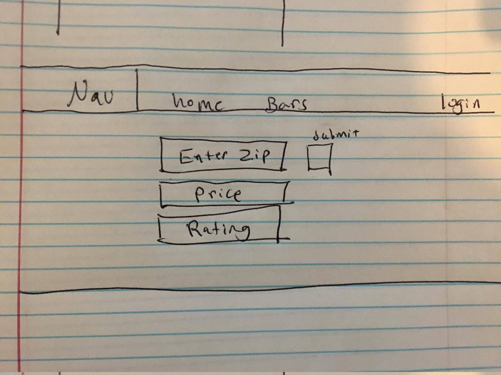
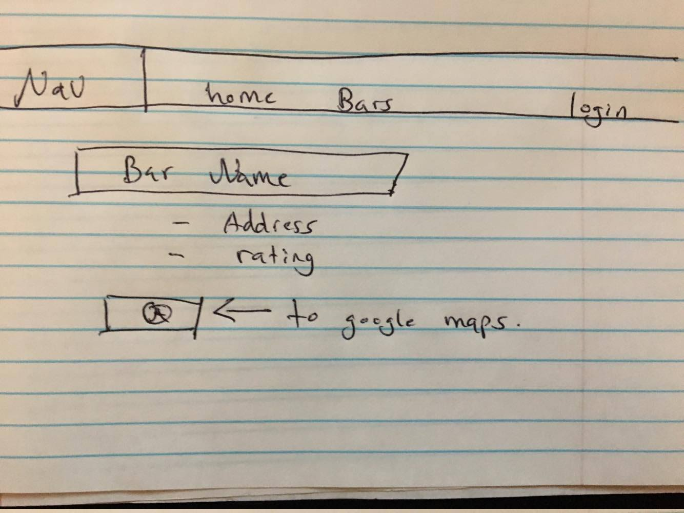
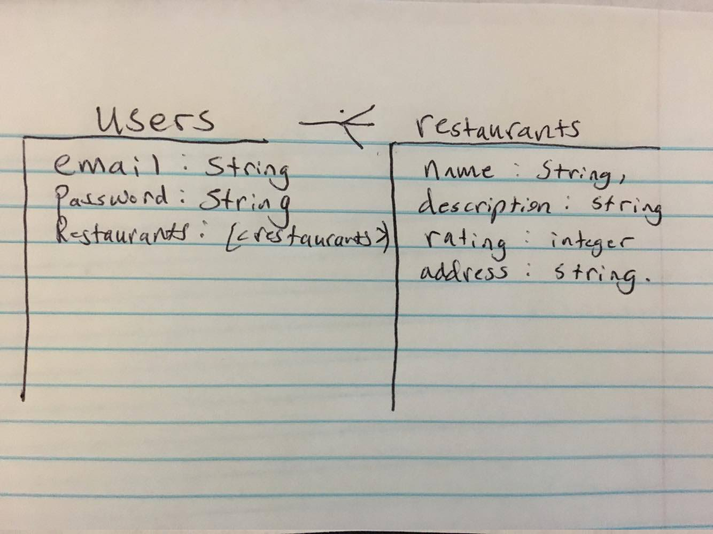

# Random Restaurant

#### Intro

Have you ever dealt with not being able to choose which restaurant to eat at?? Well hooray! Random Restaurant will be an app designed to find you a random restaurant in an area around you. Some stretches are being able to search based on a certain cuisine, number of reviews, or number of friends that checked into that location. 

#### Wireframes

#### ERD

#### Stretch Goals
- Be able to search according to Cuisine, price, rating ✓
- Allow users to make a favorites and only access favorites while logged in ✓
- use Google Maps API and Geolocator to navigate lmao.. ✗
 
#### Unsolved Problems
- Design
- Google Maps API

#### Installation Instructions
- Clone the repo
- $ npm install
- $ nodemon
- Visit localhost:3000
- Enjoy!

#### Checkout my [Trello](https://trello.com/b/GPSYsDfl/project-restaurant)!
#### Technologies used:
+ HTML
+ CSS
+ Javascript
+ jQuery
+ AJAX
+ Node.js
+ Express
+ Mongo DB
+ Bootstrap
+ Trello
+ Git & Github
+ Heroku
